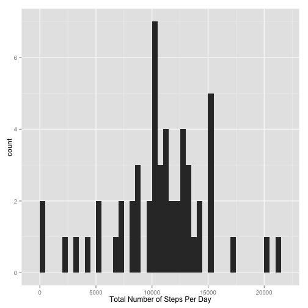
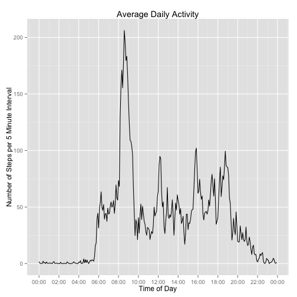
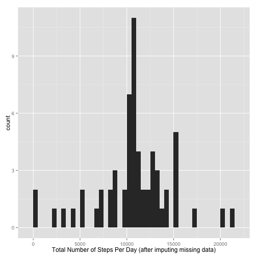
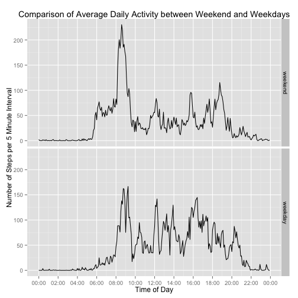

Reproducible Research (Johns Hopkins/Coursera)  
==============================================
Peer Assignment 1
===================

## Loading and preprocessing the data

First, set the knitr options to display R code

```r
library(knitr)
opts_chunk$set(echo = TRUE, echo=TRUE)
```

Next load the necessary packages:

```r
library(dplyr)
library(ggplot2)
library(scales)
library(stringr)
```

Unzip the data file and load into a data table.

```r
if(!file.exists("activity.csv")){
    unzip("activity.zip")
}
activity = read.csv("activity.csv", stringsAsFactors = FALSE, 
                    colClasses = c("integer","Date","character"))
```

## What is mean total number of steps taken per day?

The instructions says 'you can ignore the missing values in the dataset' in instructions, so no attempt will be made to modify NAs. However, we will look at the distribution of NAs to see if some treatments make more sense than others.

Taking at look at the distribution of NAs in the dataset:

```r
activity %>% filter(is.na(steps)) %>% count(date)
```

```
## Source: local data frame [8 x 2]
## 
##         date   n
## 1 2012-10-01 288
## 2 2012-10-08 288
## 3 2012-11-01 288
## 4 2012-11-04 288
## 5 2012-11-09 288
## 6 2012-11-10 288
## 7 2012-11-14 288
## 8 2012-11-30 288
```

```r
# How many days data is there in total?
length(unique(activity$date))
```

```
## [1] 61
```

We find that all the NAs occur across eight days out of sixty one total.  For each of these eight days, NAs account for the entire day's data (24 x 60 / 5 = 288 samples per day). 

Next, calculate the mean number of steps taken each day.  


```r
activityPerDay <- activity %>%
  group_by(date) %>%
  summarize(steps = sum(steps))
head(activityPerDay)
```

```
## Source: local data frame [6 x 2]
## 
##         date steps
## 1 2012-10-01    NA
## 2 2012-10-02   126
## 3 2012-10-03 11352
## 4 2012-10-04 12116
## 5 2012-10-05 13294
## 6 2012-10-06 15420
```

Note that with this particular approach 10/1/2012 which had only NA entries is included in the results with NA steps.

We then look at a histogram of the number of steps per day.  Visually, the 'typical' value appears to be around 10,000 steps in day, while there are 2 days with no steps recorded at all.


```r
ggplot( activityPerDay, aes(steps) ) + 
  geom_histogram(binwidth = 500) + 
  xlab( "Total Number of Steps Per Day")
```

 


Finally, we then calculate the mean and median steps per day, removing the NAs. Effectively, this is calculating the mean and median steps for the 53 (61 less 8) days for which there is a complete set of data.

```r
activityPerDaySummary <- activityPerDay %>%
  summarize(meanStepsPerDay = mean(steps, na.rm = TRUE), 
            medianStepsPerDay = median(steps, na.rm = TRUE))

sprintf("Mean steps per day is %.0f",
        activityPerDaySummary$meanStepsPerDay)
```

```
## [1] "Mean steps per day is 10766"
```

```r
sprintf("Median steps per day is  %.0f", 
        activityPerDaySummary$medianStepsPerDay)
```

```
## [1] "Median steps per day is  10765"
```
## What is the average daily activity pattern?

To explore the daily activity pattern, we examine at the average number of steps taken in each 5 minute time period, averaged across all the days in the sample.  

[Note a transformation is applied to the interval supplied in the original data set to allow the activity to be charted across hours of the day.  The timezone is arbitrarily set to GMT.]

```r
# Calculate average number of steps per interval
activityDiurnal <- activity %>%
  group_by(interval) %>%
  summarize(steps = mean(steps, na.rm = TRUE))

# Calculate time of day from interval
activityDiurnal$time <- as.POSIXct(str_pad(activityDiurnal$interval, 4, "left", "0"),
                                   format="%H%M", origin = "1970-01-01", "GMT")

# Display timeseries chart
ggplot( activityDiurnal, aes(time, steps) ) + geom_line() +
  scale_x_datetime(labels = date_format("%H:%M"), breaks = "2 hour") +
  xlab("Time of Day") +
  ylab("Number of Steps per 5 Minute Interval") +
  ggtitle("Average Daily Activity")
```

 

A peak of activity is observed after 8am, while minimal activity occurs between the hours of midnight to 5:30am (approximately).

Finally we examine the data to extract the 5 minute interval which has the most activity on average.


```r
activityDiurnal$time[which.max(activityDiurnal$step)]
```

```
## [1] "2015-09-16 08:35:00 GMT"
```

```r
activityDiurnal$interval[which.max(activityDiurnal$step)]
```

```
## [1] "835"
```

## Imputing missing values

The next question is: how big an effect do the missing values have?  We'll count how many NAs are present in count of steps, impute the missing values and then recalculate the mean and median steps per day.

Firstly, find out how many missing values are present:

```r
sum( is.na(activity$steps) )
```

```
## [1] 2304
```

Next, impute the missing values.  The approach here is to replace the missing value for a given 5 minute interval with the average of that 5 minute interval over all the days for which a value was present.


```r
activityImputed <- activity
for( i in 1:nrow(activity)) {
  activityImputed$steps[i] <- ifelse(is.na(activityImputed$steps[i]), 
                                     activityDiurnal$steps[ activityDiurnal$interval == activityImputed$interval[i]],
                                     activityImputed$steps[i]) 
}

activityPerDayImputed <- activityImputed %>%
  group_by(date) %>%
  summarize(steps = sum(steps))
head(activityPerDayImputed)
```

```
## Source: local data frame [6 x 2]
## 
##         date    steps
## 1 2012-10-01 10766.19
## 2 2012-10-02   126.00
## 3 2012-10-03 11352.00
## 4 2012-10-04 12116.00
## 5 2012-10-05 13294.00
## 6 2012-10-06 15420.00
```
We see that 10/1/2012 now has a non-zero, non-NA value for the number of steps  

Examining the histogram of the number of steps per day shows that, visually, it appears that there is now a greater number of days with more than 10,000 steps.


```r
ggplot( activityPerDayImputed, aes(steps) ) + 
  geom_histogram(binwidth = 500) + 
  xlab( "Total Number of Steps Per Day (after imputing missing data)")
```

 

Recalculating the mean and median steps per day after imputing missing values shows that there is no change to the mean, and only a very small change to the calculated median value.


```r
imputedActivityPerDaySummary <- activityPerDayImputed %>%
  summarize(meanStepsPerDay = mean(steps), medianStepsPerDay = median(steps))

sprintf("Mean steps per day is %.0f, (difference from non-imputed %.0f)",
        imputedActivityPerDaySummary$meanStepsPerDay, 
        imputedActivityPerDaySummary[1]-activityPerDaySummary[1])
```

```
## [1] "Mean steps per day is 10766, (difference from non-imputed 0)"
```

```r
sprintf("Median steps per day is %.0f, (difference from non-imputed %.0f)", 
        imputedActivityPerDaySummary$medianStepsPerDay,
        imputedActivityPerDaySummary[2]-activityPerDaySummary[2])
```

```
## [1] "Median steps per day is 10766, (difference from non-imputed 1)"
```


## Are there differences in activity patterns between weekdays and weekends?

The average steps per interval were calculated separately for weekdays (Mon-Fri) and weekends (Sat-Sun).  We then compare the average daily activity for weekdays vs weekends.


```r
activityImputed$dayofweek <- factor( weekdays(activityImputed$date) %in% c( "Sunday", "Saturday"), labels=c("weekend", "weekday"))

activityDiurnalImputed <- activityImputed %>%
  group_by(dayofweek, interval) %>%
  summarize(steps = mean(steps, na.rm = TRUE))

activityDiurnalImputed$time <- as.POSIXct(str_pad(activityDiurnalImputed$interval, 4, "left", "0"),
                                   format="%H%M", origin = "1970-01-01", "GMT")

ggplot( activityDiurnalImputed, aes(time, steps) ) + geom_line() + facet_grid( dayofweek ~ .) +
  scale_x_datetime(labels = date_format("%H:%M"), breaks = "2 hour") +
  xlab("Time of Day") +
  ylab("Number of Steps per 5 Minute Interval") +
  ggtitle("Comparison of Average Daily Activity between Weekend and Weekdays")
```

 

The charts do indeed show a difference in profile between weekdays and weekends with a notable change at the weekend being a reduction in the peak of activity seen between 8am-9am on weekdays.


